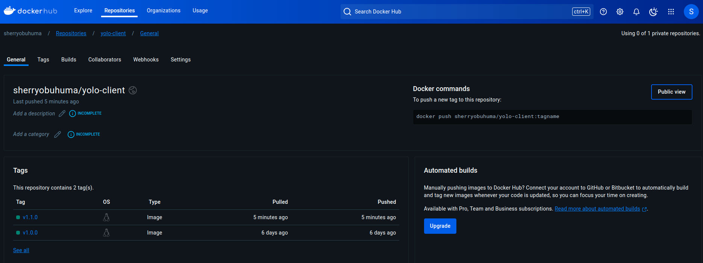
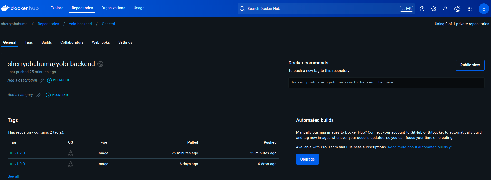

# Overview
This project involved the containerization and deployment of a full-stack yolo application using Docker. 

## Requirements
Install the docker engine here:
- https://docs.docker.com/engine/install/
- https://www.mongodb.com/

## How to launch the application
docker compose up

## 1. Frontend/Client

## 2. Backend

